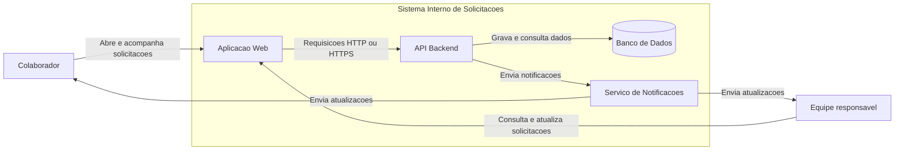
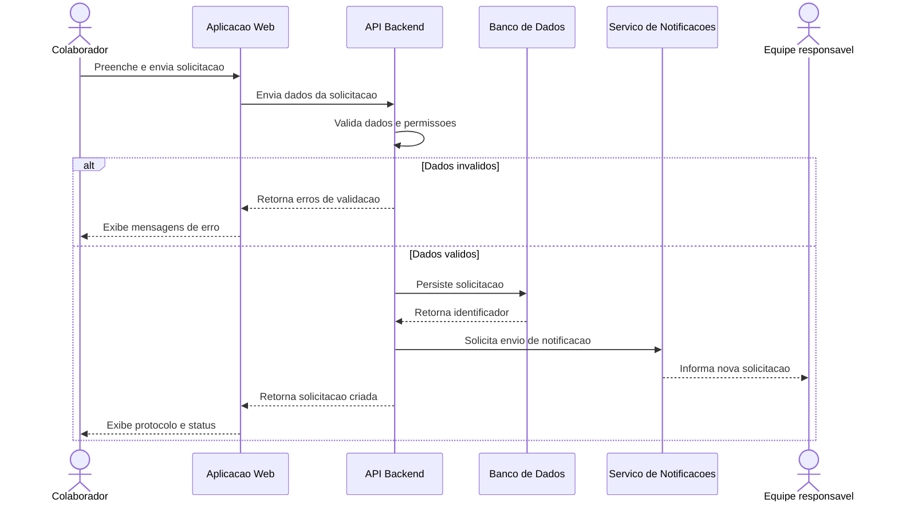

## Diagrama estrutural

```mermaid
flowchart LR
    usuario["Colaborador"]
    atendente["Equipe responsavel"]

    subgraph sistema["Sistema Interno de Solicitacoes"]
        frontend["Aplicacao Web"]
        api["API Backend"]
        banco[("Banco de Dados")]
        notificacao["Servico de Notificacoes"]
    end

    usuario -->|"Abre e acompanha solicitacoes"| frontend
    atendente -->|"Consulta e atualiza solicitacoes"| frontend
    frontend -->|"Requisicoes HTTP ou HTTPS"| api
    api -->|"Grava e consulta dados"| banco
    api -->|"Envia notificacoes"| notificacao
    notificacao -->|"Envia atualizacoes"| usuario
    notificacao -->|"Envia atualizacoes"| atendente
```

## Diagrama de sequencia

```mermaid
sequenceDiagram
    actor Colaborador
    participant Web as Aplicacao Web
    participant API as API Backend
    participant Banco as Banco de Dados
    participant Notificacao as Servico de Notificacoes
    actor Equipe as Equipe responsavel

    Colaborador->>Web: Preenche e envia solicitacao
    Web->>API: Envia dados da solicitacao
    API->>API: Valida dados e permissoes

    alt Dados invalidos
        API-->>Web: Retorna erros de validacao
        Web-->>Colaborador: Exibe mensagens de erro
    else Dados validos
        API->>Banco: Persiste solicitacao
        Banco-->>API: Retorna identificador
        API->>Notificacao: Solicita envio de notificacao
        Notificacao-->>Equipe: Informa nova solicitacao
        API-->>Web: Retorna solicitacao criada
        Web-->>Colaborador: Exibe protocolo e status
    end
```
